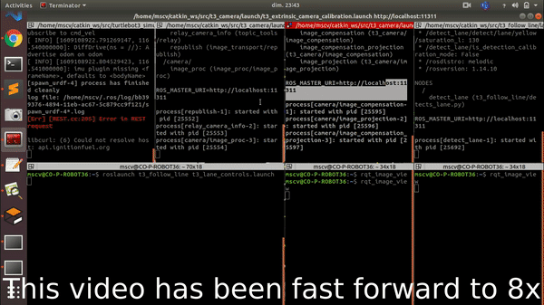
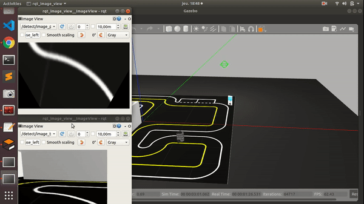
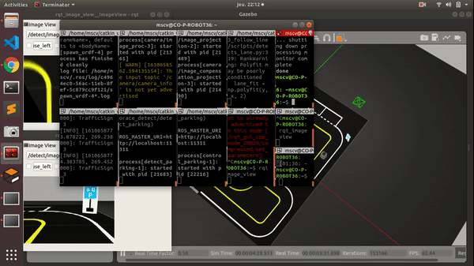

  
   

  
   

# 
Master of Computer vision and Robotics
   
<h3 align="center">Visual Servoing Project</h3> 

   
<h4 align="center"> 
Supervisors: Omar TAHRI
</h4> 

                       
Students:    
 MUHAMMAD IZZUL  Pranavan Ramakrishnan  Cheng CHEN

## Objectives

The purpose of this project is to make turtlebot3 realize the following two functions:

- Automatic tracking: make the robot track and follow a yellow line by the camera information
- Automatic parking: detect and understand parking sign and park automatically in the right position 

Our map choices: 

- Turtlebot3_autorace_2020

## Implementation
**Following line**
- To launch the map and bringup turtlebot
      
      roslaunch turtlebot3_gazebo turtlebot3_autorace.launch 
- To launch the calibration 
	   
      roslaunch t3_camera t3_intrinsic_camera_calibration.launch
      roslaunch t3_camera t3_extrinsic_camera_calibration.launch
- To launch the follow the line
	   
      roslaunch t3_follow_line t3_lane_detects.launch
      roslaunch t3_follow_line t3_lane_controls.launch

__Demonstration__ of Following line: 

  
Please click this link to download the full <a href="video/t3_following_line_video.mp4">video</a>

 
**Parking Detection and Park**
- To launch the map and bringup turtlebot
      
      roslaunch turtlebot3_gazebo turtlebot3_autorace.launch 
- To launch the calibration 
	   
      roslaunch t3_camera t3_intrinsic_camera_calibration.launch
      roslaunch t3_camera t3_extrinsic_camera_calibration.launch
- To launch the parking detection
	   
      roslaunch t3_parking_sign_detect t3_detect_sign.launch
      roslaunch t3_parking_sign_detect t3_detect_parking.launch
      roslaunch t3_parking_sign_detect t3_control_parking.launch

__Demonstration__ of Parking Detection and Park: 

  

The parking sign detected

Please click this link to download the full <a href="video/t3_detect_parking (1).mp4">video</a>
 

  

The turtlebot park at the parking

Please click this link to download the full <a href="video/t3_control_parking.mp4">video</a>

      

